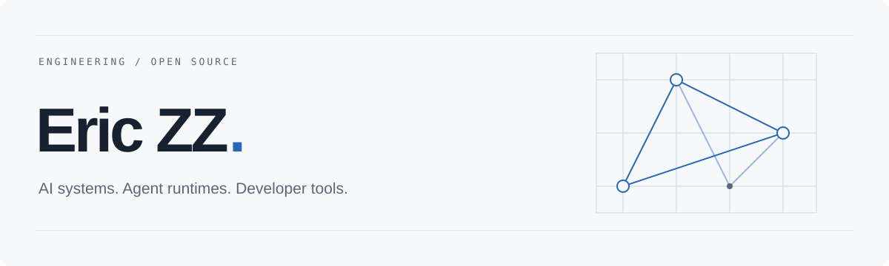

<picture>
  <source media="(prefers-color-scheme: dark)" srcset="assets/header-dark.svg">
  <source media="(prefers-color-scheme: light)" srcset="assets/header-light.svg">
  
</picture>

I build AI systems and the tools that make them useful.

My work spans agent runtimes, desktop applications, and multimodal models. I care about the details between a working demo and software people can depend on: explicit execution boundaries, inspectable state, and thoughtful interfaces.

 

### Selected work

| Project | Focus |
| :--- | :--- |
| **[Sage](https://github.com/ZHangZHengEric/Sage)** | An open-source agent framework for complex tasks. My current focus is v2: the runtime, tools, and the applications built around it. |
| **[NowHow](https://github.com/ZHangZHengEric/NowHow)** | A desktop learning agent built with Flutter and Sage. Turns real tasks into guided practice, interactive explanations, and feedback. |
| **[LingModel](https://github.com/ZHangZHengEric/LingModel)** | Experiments in multimodal model architecture and training, with separate engineering and research tracks. |

 

### Engineering interests

- **Agent infrastructure** — execution lifecycles, tool interfaces, context, and persistent sessions.
- **Human–AI interaction** — workspaces, approvals, and interfaces that make complex behavior understandable.
- **Multimodal systems** — connecting language, visual generation, and agent behavior.

 

**Python · Dart / Flutter · TypeScript / Vue**

---

[Explore Sage](https://github.com/ZHangZHengEric/Sage) &nbsp; / &nbsp; [Projects](https://github.com/ZHangZHengEric?tab=repositories) &nbsp; / &nbsp; [Website](https://zhangzhengeric.github.io/EricZZ.github.io/)
